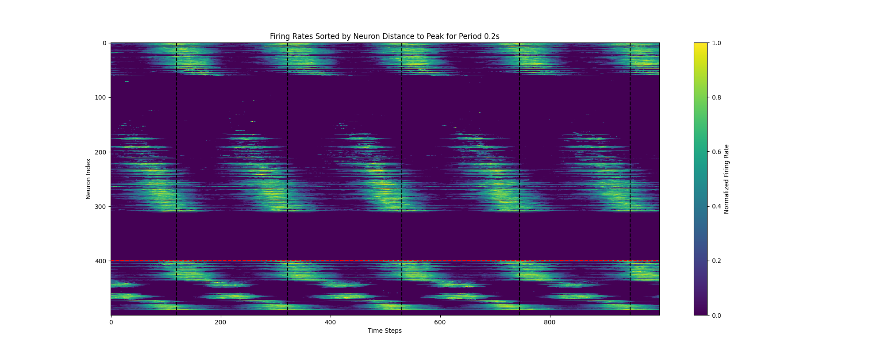

# ZemlianovaRNN    

## Overview
This repository contains the PyTorch implementation of the model described in the 2024 paper ["A Recurrent Neural Network for Rhythmic Timing"](https://www.biorxiv.org/content/10.1101/2024.05.24.595797v1.abstract) by Klavdia Zemlianova, Amit Bose, & John Rinzel. The model is designed to explore and demonstrate the neural mechanisms behind rhythmic timing.

## Features
- **ZemlianovaRNN Implementation:** Fully implemented model based on the 2024 paper, designed to explore neural mechanisms of rhythmic timing.
- **Dynamic Configuration:** Model parameters can be dynamically configured using YAML files or overridden via command-line arguments with Fire.
- **Training and Evaluation Scripts:** Scripts to train the models and evaluate their performance are included, with the ability to plot and save results for further analysis.
- **GPU Support:** Efficient training with CUDA, automatically adjusting based on available hardware.
- **Vanilla RNN Implementation:** Also a standard RNN model which can be used as a baseline or for comparison.

## Getting Started

### Prerequisites
Ensure you have Python 3.6+ and PyTorch installed. Dependencies can be installed via pip:

```bash
pip install -r requirements.txt
```

### Training the Model

To train the ZemlianovaRNN model, use:

```bash
python train.py --model_type ZemlianovaRNN
```

This will save a `best_model.pth` when the training is complete. It will also create a folder called `plots` with examples of model activity for each of the periods included in the training set. 

### Saving Model Outputs for Analysis After Training

After training, you can run inference on the model to save outputs for further analysis using:

```bash
python drive_model_and_save_outputs.py
```

This script processes inputs based on the configured periods, detects peaks in the model’s output, and saves the model outputs, hidden states, and plots. These are stored in a directory named `model_outputs`. Each file is named to indicate which saved model activity corresponds to a specific stimulus period, making it easier to track and analyze the results.

### Analyzing and Visualizing Model Outputs
Further analysis and visualization can be conducted by running:
```bash
python plot_fig1.py
```
This generates detailed plots illustrating the normalized firing rates and PCA trajectories:
- **Normalized Firing Rates:** Units' firing rates are normalized between 0 and 1 and sorted by their maximal firing rate during the initial inter-tap interval (ITI). Units are colored by type—excitatory units in red and inhibitory in blue. Tap times are marked by vertical lines.
  

- **PCA Trajectory Analysis:** 
  - **Left Panel:** Shows unit trajectories in the top 3 PCA space, colored by stimulus frequency from low to high. Tap times are indicated by black circles.
  - **Middle Panel:** Displays the relationship between the mean and standard deviation of trajectory lengths, calculated per cycle for each stimulus period.
  - **Right Panel:** Simulated inter-tap intervals (ITIs) for varying context cues, with trained points marked in yellow.
  


### Configuration
Modify the `config.yaml` file to set up different experimental settings or model parameters.

### Training the Vanilla RNN

To train the Vanilla RNN model, use the following command:

```bash
python train.py --model_type RNN
```


## Contributing
Contributions to the development of ZemlianovaRNN are welcome. Please submit a pull request or open an issue to discuss proposed changes or additions.

## Cite

If you use this code please cite the original paper:

```
@article{zemlianova2024recurrent,
  title={A Recurrent Neural Network for Rhythmic Timing},
  author={Zemlianova, Klavdia and Bose, Amitabha and Rinzel, John},
  journal={bioRxiv},
  pages={2024--05},
  year={2024},
  publisher={Cold Spring Harbor Laboratory}
}
```
